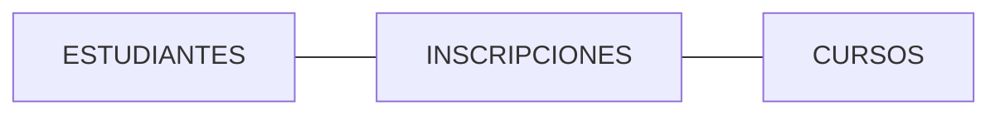

# 🚀 Bases de Datos y Normalización

## Conceptos fundamentales para el diseño eficiente de BD

<div class="absolute bottom-10">
  <span class="font-600">
    q
  </span>
</div>

---
transition: fade
---

# 🌟 Introducción

<v-clicks>

## ¿Qué es una Base de Datos?

Una **colección organizada** de datos estructurados, típicamente almacenados y gestionados electrónicamente.

## Propósito

Almacenar, gestionar y recuperar información de manera **eficiente y segura**.

## Conceptos Clave

- **Tablas** (relaciones)
- **Filas** (registros)  
- **Columnas** (atributos)

</v-clicks>

---
layout: default-6
transition: slide-up
---

# 🧠 Semántica de Datos

<v-click>

## Definición

El **significado** de los datos y su relación con el mundo real.

</v-click>

<v-click at="2">

### Ejemplo

Muestra cómo un dato se relaciona con una entidad real:

En una tabla `EMPLEADOS`:
- `Fecha_Nac` = Fecha de nacimiento real

</v-click>

---
layout: right
transition: slide-up
---

# 🌳 Modelos de Datos Básicos

<v-click>

## 📊 Modelo Relacional

- Datos organizados en **tablas bidimensionales** (filas y columnas).
- Se basa en la teoría de conjuntos.
- **Ejemplo:** `CLIENTES` ↔ `PEDIDOS`

</v-click>

<v-click at="2">

## 🌐 Otros Modelos

- Jerárquico / Red (Modelos históricos, predecesores del relacional)
- Orientado a Objetos (Representa datos y comportamiento juntos)

</v-click>

---
layout: center
transition: slide-left
---

# 🛡️ Formas Normales (FN)

<v-click>

## Definición

Reglas progresivas para **eliminar redundancia** y anomalías en el diseño de Bases de Datos.

</v-click>

---
layout: default
transition: slide-left
---

# 📝 Principales Formas Normales

<v-clicks depth="3">

- **1FN**: Primera Forma Normal

  - Valores **atómicos** (indivisibles)
  


- **2FN**: Segunda Forma Normal  

  - Cumple 1FN

  - Atributos no clave dependen de **toda la clave**
  


- **3FN**: Tercera Forma Normal

  - Cumple 2FN

  - Sin **dependencias transitivas**


</v-clicks>

---
layout: center
---

# 🔗 Entidad Referencial

<v-click>

## Tabla de Intersección / Pivote

</v-click>

<v-click at="2">

Resuelve relaciones **Muchos a Muchos (N:M)**

</v-click>

<v-click at="3">

### Ejemplo Práctico



La tabla `INSCRIPCIONES` relaciona estudiantes con cursos mediante:
- `ID_Estudiante` (FK)
- `ID_Curso` (FK)

</v-click>

---
transition: fade-out
---

# 🔑 Tipos de Atributos Clave

<v-clicks every="2">

## Clave Principal (Primary Key)
Identifica **únicamente** cada fila
- Ejemplo: `ID_Estudiante`

## Clave Candidata (Candidate Key)
Podría ser clave principal
- Ejemplo: `ID_Empleado` o `Número_Seguro_Social`

## Atributo Normal (Non-Key)
Datos descriptivos
- Ejemplo: `Nombre`, `Dirección`, `Salario`

</v-clicks>

---
layout: default-5
---

# 📐 Normalización

<v-click>

## Proceso Sistemático

Descomponer tablas problemáticas en estructuras más pequeñas y eficientes.

</v-click>

<v-click at="2">

## Objetivos
- ✅ Reducir redundancia
- ✅ Mejorar integridad
- ✅ Prevenir anomalías

</v-click>

---
layout: default-5
---

# 💡 Ejemplo Práctico: 1FN → 2FN

<v-click>

## Antes (Problemas)

```
PEDIDOS_PRODUCTOS

├── ID_Pedido
├── ID_Producto
├── Nombre_Producto ❌
└── Precio_Producto ❌
```

**Después (Normalizado):**

```
PEDIDOS_DETALLE

├── ID_Pedido
└── ID_Producto

PRODUCTOS

├── ID_Producto
├── Nombre_Producto ✅
└── Precio_Producto ✅
```

</v-click>

---
transition: slide-right
---

# 💻 Normalización a Objetos

<v-clicks>

## Contexto
Bases de Datos Orientadas a Objetos (OODB)

Concepto Clave: **Encapsulación** de datos y comportamiento en clases

## Diferencias con Normalización Relacional

| Relacional | Orientada a Objetos |
|------------|-------------------|
| Dependencia funcional | Identidad del objeto |
| Tablas y relaciones | Herencia y agregación |
| SQL | Métodos y mensajes |

</v-clicks>

---

# 📝 Normalización de Nombres

<v-clicks depth="2">

## Convenciones Comunes

- **Tablas**: Usar plural
  - ✅ `CLIENTES`
  - ❌ `CLIENTE`

- **Columnas**: Usar singular
  - ✅ `Nombre`
  - ❌ `Nombres`

</v-clicks>

---

# 📝 Normalización de Nombres

<v-clicks depth="2">

## Convenciones Comunes

- **Separación de palabras**:
  - Snake_case: `ID_Cliente`
  - CamelCase: `IdCliente`

- **Prefijos para FK**: `fk_cliente_id`

</v-clicks>

---
layout: center
---

# 🤝 Integridad Referencial

<div v-motion
  :initial="{ opacity: 0, y: 20 }"
  :enter="{ opacity: 1, y: 0 }"
  :duration="500">

## Regla fundamental de BD Relacionales

</div>

<v-click>

### Implementación: Claves Foráneas (FK)

</v-click>

<v-click at="2">

```sql
-- Ejemplo práctico
CREATE TABLE PEDIDOS (
    ID_Pedido INT PRIMARY KEY,
    ID_Cliente INT,
    FOREIGN KEY (ID_Cliente) 
    REFERENCES CLIENTES(ID_Cliente)
);
```

</v-click>

<v-click at="3">

> **Beneficio**: No puedes crear un pedido para un cliente inexistente

</v-click>

---
layout: cover
transition: fade
---

# ✅ Conclusión

<v-clicks>

## 🎯 Idea Principal
La **Normalización** y la **Integridad Referencial** son fundamentales para BD robustas

## 💡 Beneficios Clave

<div class="grid grid-cols-3 gap-4 mt-8">
  <div class="text-center p-4 bg-blue-500/10 rounded">
    <div class="text-3xl mb-2">💾</div>
    <div>Menos redundancia</div>
  </div>
  <div class="text-center p-4 bg-green-500/10 rounded">
    <div class="text-3xl mb-2">🔒</div>
    <div>Mayor integridad</div>
  </div>
  <div class="text-center p-4 bg-purple-500/10 rounded">
    <div class="text-3xl mb-2">🛠️</div>
    <div>Fácil mantenimiento</div>
  </div>
</div>

</v-clicks>

---
layout: end
---

# ¡Gracias! 🙌

## ¿Preguntas?

<div class="mt-10">

</div>
